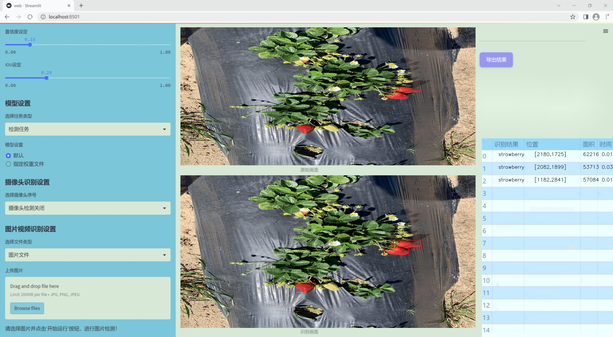
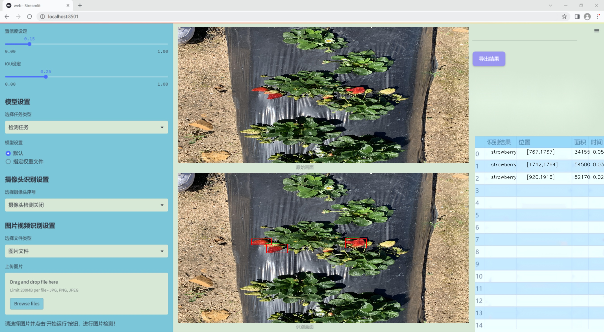
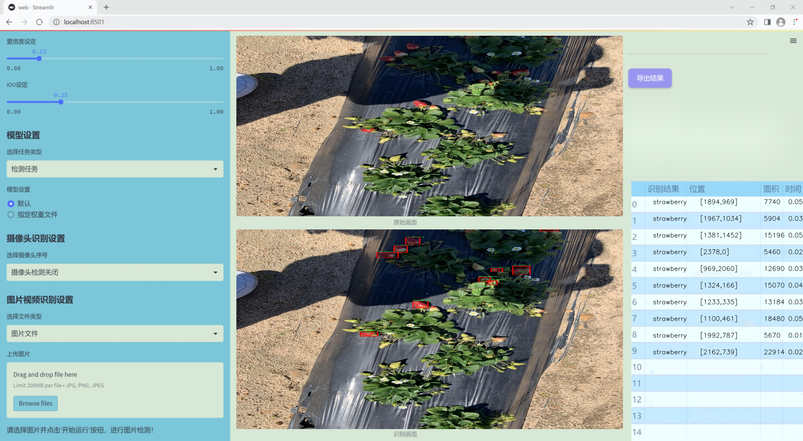

# 改进yolo11-ContextGuided等200+全套创新点大全：草莓果实检测系统源码＆数据集全套

### 1.图片效果展示







##### 项目来源 **[人工智能促进会 2024.11.03](https://kdocs.cn/l/cszuIiCKVNis)**

注意：由于项目一直在更新迭代，上面“1.图片效果展示”和“2.视频效果展示”展示的系统图片或者视频可能为老版本，新版本在老版本的基础上升级如下：（实际效果以升级的新版本为准）

  （1）适配了YOLOV11的“目标检测”模型和“实例分割”模型，通过加载相应的权重（.pt）文件即可自适应加载模型。

  （2）支持“图片识别”、“视频识别”、“摄像头实时识别”三种识别模式。

  （3）支持“图片识别”、“视频识别”、“摄像头实时识别”三种识别结果保存导出，解决手动导出（容易卡顿出现爆内存）存在的问题，识别完自动保存结果并导出到tempDir中。

  （4）支持Web前端系统中的标题、背景图等自定义修改。

  另外本项目提供训练的数据集和训练教程,暂不提供权重文件（best.pt）,需要您按照教程进行训练后实现图片演示和Web前端界面演示的效果。

### 2.视频效果展示

[2.1 视频效果展示](https://www.bilibili.com/video/BV1qUDEYSE5q/)

### 3.背景

研究背景与意义

随着农业现代化的不断推进，智能化技术在农业生产中的应用日益广泛。尤其是在果蔬种植领域，精准的果实检测技术不仅能够提高作物的产量和质量，还能有效降低人工成本，提升农业生产的效率。草莓作为一种经济价值高、市场需求大的水果，其种植和管理过程中的果实检测显得尤为重要。传统的人工检测方法不仅耗时耗力，而且容易受到人为因素的影响，导致检测结果的不准确。因此，基于计算机视觉的自动化果实检测系统应运而生。

在众多的目标检测算法中，YOLO（You Only Look Once）系列因其高效性和实时性而受到广泛关注。YOLOv11作为该系列的最新版本，具备了更强的特征提取能力和更快的处理速度，能够在复杂的环境中实现高精度的目标检测。然而，针对特定作物的检测需求，现有的YOLOv11模型仍存在一定的局限性，尤其是在小目标检测和多种类果实的识别方面。因此，改进YOLOv11模型以适应草莓果实的检测需求，具有重要的研究价值和实际意义。

本研究将基于现有的草莓果实数据集，利用450张图像进行模型训练和测试，探索改进YOLOv11在草莓果实检测中的应用效果。通过对模型的优化与调整，期望能够提高草莓果实的检测精度和效率，为智能农业的发展提供有力支持。此外，该研究还将为其他水果和蔬菜的智能检测提供借鉴，推动农业领域的技术创新与发展。

### 4.数据集信息展示

##### 4.1 本项目数据集详细数据（类别数＆类别名）

nc: 1
names: ['strawberry']


该项目为【目标检测】数据集，请在【训练教程和Web端加载模型教程（第三步）】这一步的时候按照【目标检测】部分的教程来训练

##### 4.2 本项目数据集信息介绍

本项目数据集信息介绍

本项目所使用的数据集名为“strawberry.00”，旨在为改进YOLOv11的草莓果实检测系统提供高质量的训练数据。该数据集专注于草莓这一特定类别，包含了丰富的草莓果实图像，确保了模型在识别和检测草莓时的准确性和鲁棒性。数据集中类别数量为1，类别列表中仅包含“strawberry”这一项，表明数据集的专一性和针对性，使得模型能够在草莓果实检测任务中充分发挥其性能。

“strawberry.00”数据集的构建过程中，采用了多样化的采集方式，涵盖了不同生长阶段、不同光照条件和不同背景下的草莓图像。这种多样性不仅增强了数据集的代表性，也提高了模型在实际应用中的适应能力。此外，数据集中的图像经过精心标注，确保每一张图像中的草莓果实都被准确框定，为模型的训练提供了可靠的监督信号。

在训练过程中，改进YOLOv11将利用该数据集进行深度学习，以优化其特征提取和目标检测能力。通过对“strawberry.00”数据集的反复训练，模型将逐步学习到草莓果实的特征，从而在复杂环境中实现高效的检测与识别。这一过程不仅提升了模型的准确性，也为后续的实际应用奠定了坚实的基础。

综上所述，“strawberry.00”数据集为本项目提供了丰富的草莓果实图像资源，助力于改进YOLOv11在草莓检测任务中的表现，推动农业智能化的发展。通过充分利用这一数据集，我们期望能够实现更高效、更精准的草莓果实检测系统，为农业生产提供强有力的技术支持。


### 5.全套项目环境部署视频教程（零基础手把手教学）

[5.1 所需软件PyCharm和Anaconda安装教程（第一步）](https://www.bilibili.com/video/BV1BoC1YCEKi/?spm_id_from=333.999.0.0&vd_source=bc9aec86d164b67a7004b996143742dc)


[5.2 安装Python虚拟环境创建和依赖库安装视频教程（第二步）](https://www.bilibili.com/video/BV1ZoC1YCEBw?spm_id_from=333.788.videopod.sections&vd_source=bc9aec86d164b67a7004b996143742dc)

### 6.改进YOLOv11训练教程和Web_UI前端加载模型教程（零基础手把手教学）

[6.1 改进YOLOv11训练教程和Web_UI前端加载模型教程（第三步）](https://www.bilibili.com/video/BV1BoC1YCEhR?spm_id_from=333.788.videopod.sections&vd_source=bc9aec86d164b67a7004b996143742dc)


按照上面的训练视频教程链接加载项目提供的数据集，运行train.py即可开始训练



     Epoch   gpu_mem       box       obj       cls    labels  img_size
     1/200     20.8G   0.01576   0.01955  0.007536        22      1280: 100%|██████████| 849/849 [14:42<00:00,  1.04s/it]
               Class     Images     Labels          P          R     mAP@.5 mAP@.5:.95: 100%|██████████| 213/213 [01:14<00:00,  2.87it/s]
                 all       3395      17314      0.994      0.957      0.0957      0.0843

     Epoch   gpu_mem       box       obj       cls    labels  img_size
     2/200     20.8G   0.01578   0.01923  0.007006        22      1280: 100%|██████████| 849/849 [14:44<00:00,  1.04s/it]
               Class     Images     Labels          P          R     mAP@.5 mAP@.5:.95: 100%|██████████| 213/213 [01:12<00:00,  2.95it/s]
                 all       3395      17314      0.996      0.956      0.0957      0.0845

     Epoch   gpu_mem       box       obj       cls    labels  img_size
     3/200     20.8G   0.01561    0.0191  0.006895        27      1280: 100%|██████████| 849/849 [10:56<00:00,  1.29it/s]
               Class     Images     Labels          P          R     mAP@.5 mAP@.5:.95: 100%|███████   | 187/213 [00:52<00:00,  4.04it/s]
                 all       3395      17314      0.996      0.957      0.0957      0.0845


###### [项目数据集下载链接](https://kdocs.cn/l/cszuIiCKVNis)

### 7.原始YOLOv11算法讲解


##### YOLOv11三大损失函数

YOLOv11（You Only Look Once）是一种流行的目标检测算法，其损失函数设计用于同时优化分类和定位任务。YOLO的损失函数通常包括几个部分：
**分类损失、定位损失（边界框回归损失）和置信度损失** 。其中，

  1. box_loss（边界框回归损失）是用于优化预测边界框与真实边界框之间的差异的部分。

  2. cls_loss（分类损失）是用于优化模型对目标类别的预测准确性的部分。分类损失确保模型能够正确地识别出图像中的对象属于哪个类别。

  3. dfl_loss（Distribution Focal Loss）是YOLO系列中的一种损失函数，特别是在一些改进版本如YOLOv5和YOLOv7中被引入。它的主要目的是解决目标检测中的类别不平衡问题，并提高模型在处理小目标和困难样本时的性能。

##### 边界框回归损失详解

box_loss（边界框回归损失）是用于优化预测边界框与真实边界框之间的差异的部分。


##### box_loss 的具体意义


##### 为什么需要 box_loss

  * 精确定位：通过最小化中心点坐标损失和宽高损失，模型能够更准确地预测目标的位置和大小。
  * 平衡不同类型的目标：使用平方根来处理宽高损失，可以更好地平衡不同大小的目标，确保小目标也能得到足够的关注。
  * 稳定训练：适当的损失函数设计有助于模型的稳定训练，避免梯度爆炸或消失等问题。

##### 分类损失详解

在YOLO（You Only Look
Once）目标检测算法中，cls_loss（分类损失）是用于优化模型对目标类别的预测准确性的部分。分类损失确保模型能够正确地识别出图像中的对象属于哪个类别。下面是关于cls_loss的详细解读：

##### 分类损失 (cls_loss) 的具体意义

  
分类损失通常使用交叉熵损失（Cross-Entropy
Loss）来计算。交叉熵损失衡量的是模型预测的概率分布与真实标签之间的差异。在YOLO中，分类损失的具体形式如下：


##### 为什么需要 cls_loss

  * 类别识别：cls_loss 确保模型能够正确识别出图像中的目标属于哪个类别。这对于目标检测任务至关重要，因为不仅需要知道目标的位置，还需要知道目标的类型。

  * 多类别支持：通过最小化分类损失，模型可以处理多个类别的目标检测任务。例如，在道路缺陷检测中，可能需要识别裂缝、坑洞、路面破损等多种类型的缺陷。

  * 提高准确性：分类损失有助于提高模型的分类准确性，从而提升整体检测性能。通过优化分类损失，模型可以更好地学习不同类别之间的特征差异。

##### 分布损失详解

`dfl_loss`（Distribution Focal
Loss）是YOLO系列中的一种损失函数，特别是在一些改进版本如YOLOv5和YOLOv7中被引入。它的主要目的是解决目标检测中的类别不平衡问题，并提高模型在处理小目标和困难样本时的性能。下面是对`dfl_loss`的详细解读：

##### DFL Loss 的背景

在目标检测任务中，类别不平衡是一个常见的问题。某些类别的样本数量可能远远多于其他类别，这会导致模型在训练过程中对常见类别的学习效果较好，而对罕见类别的学习效果较差。此外，小目标和困难样本的检测也是一个挑战，因为这些目标通常具有较少的特征信息，容易被忽略或误分类。

为了应对这些问题，研究者们提出了多种改进方法，其中之一就是`dfl_loss`。`dfl_loss`通过引入分布焦点损失来增强模型对困难样本的关注，并改善类别不平衡问题。

##### DFL Loss 的定义

DFL Loss
通常与传统的交叉熵损失结合使用，以增强模型对困难样本的学习能力。其核心思想是通过对每个类别的预测概率进行加权，使得模型更加关注那些难以正确分类的样本。

DFL Loss 的公式可以表示为：


##### DFL Loss 的具体意义**

  * **类别不平衡：** 通过引入平衡因子 α，DFL Loss 可以更好地处理类别不平衡问题。对于少数类别的样本，可以通过增加其权重来提升其重要性，从而提高模型对这些类别的检测性能。
  *  **困难样本：** 通过聚焦参数 γ，DFL Loss 可以让模型更加关注那些难以正确分类的样本。当 
  * γ 较大时，模型会对那些预测概率较低的样本给予更多的关注，从而提高这些样本的分类准确性。
  *  **提高整体性能** ：DFL Loss 结合了传统交叉熵损失的优势，并通过加权机制增强了模型对困难样本的学习能力，从而提高了整体的检测性能。


### 8.200+种全套改进YOLOV11创新点原理讲解

#### 8.1 200+种全套改进YOLOV11创新点原理讲解大全

由于篇幅限制，每个创新点的具体原理讲解就不全部展开，具体见下列网址中的改进模块对应项目的技术原理博客网址【Blog】（创新点均为模块化搭建，原理适配YOLOv5~YOLOv11等各种版本）

[改进模块技术原理博客【Blog】网址链接](https://gitee.com/qunmasj/good)


#### 8.2 精选部分改进YOLOV11创新点原理讲解

###### 这里节选部分改进创新点展开原理讲解(完整的改进原理见上图和[改进模块技术原理博客链接](https://gitee.com/qunmasj/good)【如果此小节的图加载失败可以通过CSDN或者Github搜索该博客的标题访问原始博客，原始博客图片显示正常】

### MS-Block简介
实时目标检测，以YOLO系列为例，已在工业领域中找到重要应用，特别是在边缘设备（如无人机和机器人）中。与之前的目标检测器不同，实时目标检测器旨在在速度和准确性之间追求最佳平衡。为了实现这一目标，提出了大量的工作：从第一代DarkNet到CSPNet，再到最近的扩展ELAN，随着性能的快速增长，实时目标检测器的架构经历了巨大的变化。

尽管性能令人印象深刻，但在不同尺度上识别对象仍然是实时目标检测器面临的基本挑战。这促使作者设计了一个强大的编码器架构，用于学习具有表现力的多尺度特征表示。具体而言，作者从两个新的角度考虑为实时目标检测编码多尺度特征：

从局部视角出发，作者设计了一个具有简单而有效的分层特征融合策略的MS-Block。受到Res2Net的启发，作者在MS-Block中引入了多个分支来进行特征提取，但不同的是，作者使用了一个带有深度卷积的 Inverted Bottleneck Block块，以实现对大Kernel的高效利用。

从全局视角出发，作者提出随着网络加深逐渐增加卷积的Kernel-Size。作者在浅层使用小Kernel卷积来更高效地处理高分辨率特征。另一方面，在深层中，作者采用大Kernel卷积来捕捉广泛的信息。

基于以上设计原则，作者呈现了作者的实时目标检测器，称为YOLO-MS。为了评估作者的YOLO-MS的性能，作者在MS COCO数据集上进行了全面的实验。还提供了与其他最先进方法的定量比较，以展示作者方法的强大性能。如图1所示，YOLO-MS在计算性能平衡方面优于其他近期的实时目标检测器。


具体而言，YOLO-MS-XS在MS COCO上获得了43%+的AP得分，仅具有450万个可学习参数和8.7亿个FLOPs。YOLO-MS-S和YOLO-MS分别获得了46%+和51%+的AP，可学习参数分别为810万和2220万。此外，作者的工作还可以作为其他YOLO模型的即插即用模块。通常情况下，作者的方法可以将YOLOv11的AP从37%+显著提高到40%+，甚至还可以使用更少的参数和FLOPs。

CSP Block是一个基于阶段级梯度路径的网络，平衡了梯度组合和计算成本。它是广泛应用于YOLO系列的基本构建块。已经提出了几种变体，包括YOLOv4和YOLOv11中的原始版本，Scaled YOLOv4中的CSPVoVNet，YOLOv11中的ELAN，以及RTMDet中提出的大Kernel单元。作者在图2(a)和图2(b)中分别展示了原始CSP块和ELAN的结构。


上述实时检测器中被忽视的一个关键方面是如何在基本构建块中编码多尺度特征。其中一个强大的设计原则是Res2Net，它聚合了来自不同层次的特征以增强多尺度表示。然而，这一原则并没有充分探索大Kernel卷积的作用，而大Kernel卷积已经在基于CNN的视觉识别任务模型中证明有效。将大Kernel卷积纳入Res2Net的主要障碍在于它们引入的计算开销，因为构建块采用了标准卷积。在作者的方法中，作者提出用 Inverted Bottleneck Block替代标准的3 × 3卷积，以享受大Kernel卷积的好处。

#### MS-Block

基于前面的分析，参考该博客提出了一个带有分层特征融合策略的全新Block，称为MS-Block，以增强实时目标检测器在提取多尺度特征时的能力，同时保持快速的推理速度。

MS-Block的具体结构如图2(c)所示。假设是输入特征。通过1×1卷积的转换后，X的通道维度增加到n*C。然后，作者将X分割成n个不同的组，表示为，其中。为了降低计算成本，作者选择n为3。

注意，除了之外，每个其他组都经过一个 Inverted Bottleneck Block层，用表示，其中k表示Kernel-Size，以获得。的数学表示如下：


根据这个公式，作者不将 Inverted Bottleneck Block层连接到，使其作为跨阶段连接，并保留来自前面层的信息。最后，作者将所有分割连接在一起，并应用1×1卷积来在所有分割之间进行交互，每个分割都编码不同尺度的特征。当网络加深时，这个1×1卷积也用于调整通道数。

#### Heterogeneous Kernel Selection Protocol
除了构建块的设计外，作者还从宏观角度探讨了卷积的使用。之前的实时目标检测器在不同的编码器阶段采用了同质卷积（即具有相同Kernel-Size的卷积），但作者认为这不是提取多尺度语义信息的最佳选项。

在金字塔结构中，从检测器的浅阶段提取的高分辨率特征通常用于捕捉细粒度语义，将用于检测小目标。相反，来自网络较深阶段的低分辨率特征用于捕捉高级语义，将用于检测大目标。如果作者在所有阶段都采用统一的小Kernel卷积，深阶段的有效感受野（ERF）将受到限制，影响大目标的性能。在每个阶段中引入大Kernel卷积可以帮助解决这个问题。然而，具有大的ERF的大Kernel可以编码更广泛的区域，这增加了在小目标外部包含噪声信息的概率，并且降低了推理速度。

在这项工作中，作者建议在不同阶段中采用异构卷积，以帮助捕获更丰富的多尺度特征。具体来说，在编码器的第一个阶段中，作者采用最小Kernel卷积，而最大Kernel卷积位于最后一个阶段。随后，作者逐步增加中间阶段的Kernel-Size，使其与特征分辨率的增加保持一致。这种策略允许提取细粒度和粗粒度的语义信息，增强了编码器的多尺度特征表示能力。

正如图所示，作者将k的值分别分配给编码器中的浅阶段到深阶段，取值为3、5、7和9。作者将其称为异构Kernel选择（HKS）协议。


作者的HKS协议能够在深层中扩大感受野，而不会对浅层产生任何其他影响。第4节的图4支持了作者的分析。此外，HKS不仅有助于编码更丰富的多尺度特征，还确保了高效的推理。

如表1所示，将大Kernel卷积应用于高分辨率特征会产生较高的计算开销。然而，作者的HKS协议在低分辨率特征上采用大Kernel卷积，从而与仅使用大Kernel卷积相比，大大降低了计算成本。


在实践中，作者经验性地发现，采用HKS协议的YOLO-MS的推理速度几乎与仅使用深度可分离的3 × 3卷积相同。


如图所示，作者模型的Backbone由4个阶段组成，每个阶段后面跟随1个步长为2的3 × 3卷积进行下采样。在第3个阶段后，作者添加了1个SPP块，与RTMDet中一样。在作者的编码器上，作者使用PAFPN作为Neck来构建特征金字塔[31, 35]。它融合了从Backbone不同阶段提取的多尺度特征。Neck中使用的基本构建块也是作者的MS-Block，在其中使用3 × 3深度可分离卷积进行快速推理。

此外，为了在速度和准确性之间取得更好的平衡，作者将Backbone中多级特征的通道深度减半。作者提供了3个不同尺度的YOLO-MS变体，即YOLO-MS-XS、YOLO-MS-S和YOLO-MS。不同尺度的YOLO-MS的详细配置列在表2中。对于YOLO-MS的其他部分，作者将其保持与RTMDet相同。


### 9.系统功能展示

图9.1.系统支持检测结果表格显示

  图9.2.系统支持置信度和IOU阈值手动调节

  图9.3.系统支持自定义加载权重文件best.pt(需要你通过步骤5中训练获得)

  图9.4.系统支持摄像头实时识别

  图9.5.系统支持图片识别

  图9.6.系统支持视频识别

  图9.7.系统支持识别结果文件自动保存

  图9.8.系统支持Excel导出检测结果数据


### 10. YOLOv11核心改进源码讲解

#### 10.1 val.py

以下是经过简化和注释的核心代码部分，保留了YOLO检测验证器的主要功能和逻辑：

```python
import os
import torch
from ultralytics.data import build_dataloader, build_yolo_dataset, converter
from ultralytics.engine.validator import BaseValidator
from ultralytics.utils import LOGGER, ops
from ultralytics.utils.metrics import ConfusionMatrix, DetMetrics, box_iou

class DetectionValidator(BaseValidator):
    """
    检测验证器类，继承自BaseValidator，用于基于检测模型的验证。
    """

    def __init__(self, dataloader=None, save_dir=None, pbar=None, args=None, _callbacks=None):
        """初始化检测模型，设置必要的变量和参数。"""
        super().__init__(dataloader, save_dir, pbar, args, _callbacks)
        self.metrics = DetMetrics(save_dir=self.save_dir)  # 初始化检测指标
        self.iouv = torch.linspace(0.5, 0.95, 10)  # mAP@0.5:0.95的IoU向量
        self.niou = self.iouv.numel()  # IoU数量

    def preprocess(self, batch):
        """预处理图像批次，为YOLO训练做准备。"""
        batch["img"] = batch["img"].to(self.device, non_blocking=True)  # 将图像转移到设备
        batch["img"] = (batch["img"].half() if self.args.half else batch["img"].float()) / 255  # 归一化图像
        for k in ["batch_idx", "cls", "bboxes"]:
            batch[k] = batch[k].to(self.device)  # 将其他数据转移到设备
        return batch

    def postprocess(self, preds):
        """对预测输出应用非极大值抑制（NMS）。"""
        return ops.non_max_suppression(
            preds,
            self.args.conf,
            self.args.iou,
            multi_label=True,
            agnostic=self.args.single_cls,
            max_det=self.args.max_det,
        )

    def update_metrics(self, preds, batch):
        """更新指标统计信息。"""
        for si, pred in enumerate(preds):
            npr = len(pred)  # 当前预测数量
            pbatch = self._prepare_batch(si, batch)  # 准备当前批次数据
            cls, bbox = pbatch.pop("cls"), pbatch.pop("bbox")  # 获取类别和边界框
            if npr == 0:
                continue  # 如果没有预测，跳过

            predn = self._prepare_pred(pred, pbatch)  # 准备预测数据
            stat = {
                "conf": predn[:, 4],  # 置信度
                "pred_cls": predn[:, 5],  # 预测类别
                "tp": self._process_batch(predn, bbox, cls)  # 计算真正例
            }
            # 更新统计信息
            for k in self.stats.keys():
                self.stats[k].append(stat[k])

    def _process_batch(self, detections, gt_bboxes, gt_cls):
        """返回正确的预测矩阵。"""
        iou = box_iou(gt_bboxes, detections[:, :4])  # 计算IoU
        return self.match_predictions(detections[:, 5], gt_cls, iou)  # 匹配预测与真实标签

    def get_stats(self):
        """返回指标统计信息和结果字典。"""
        stats = {k: torch.cat(v, 0).cpu().numpy() for k, v in self.stats.items()}  # 转换为numpy数组
        if len(stats) and stats["tp"].any():
            self.metrics.process(**stats)  # 处理指标
        return self.metrics.results_dict  # 返回结果字典

    def print_results(self):
        """打印每个类别的训练/验证集指标。"""
        pf = "%22s" + "%11i" * 2 + "%11.3g" * len(self.metrics.keys)  # 打印格式
        LOGGER.info(pf % ("all", self.seen, self.nt_per_class.sum(), *self.metrics.mean_results()))  # 打印总结果

    def build_dataset(self, img_path, mode="val", batch=None):
        """构建YOLO数据集。"""
        return build_yolo_dataset(self.args, img_path, batch, self.data, mode=mode)

    def get_dataloader(self, dataset_path, batch_size):
        """构建并返回数据加载器。"""
        dataset = self.build_dataset(dataset_path, batch=batch_size, mode="val")
        return build_dataloader(dataset, batch_size, self.args.workers, shuffle=False)  # 返回数据加载器
```

### 代码说明：
1. **DetectionValidator类**：该类用于验证YOLO模型的性能，继承自`BaseValidator`。
2. **__init__方法**：初始化验证器，设置必要的参数和指标。
3. **preprocess方法**：对输入的图像批次进行预处理，包括设备转移和归一化。
4. **postprocess方法**：应用非极大值抑制（NMS）来过滤预测结果。
5. **update_metrics方法**：更新当前批次的指标统计信息。
6. **_process_batch方法**：计算预测与真实标签之间的匹配情况。
7. **get_stats方法**：返回当前的指标统计信息。
8. **print_results方法**：打印每个类别的验证结果。
9. **build_dataset和get_dataloader方法**：构建数据集和数据加载器，便于后续的验证过程。

通过这些核心部分，`DetectionValidator`能够有效地进行YOLO模型的验证和性能评估。

这个程序文件 `val.py` 是一个用于目标检测模型验证的实现，主要是基于 Ultralytics YOLO 框架。它扩展了一个基础验证器类 `BaseValidator`，提供了一系列功能来评估目标检测模型的性能。

首先，文件导入了一些必要的库，包括操作系统相关的库、路径处理库、NumPy 和 PyTorch。它还引入了 Ultralytics 的一些模块，如数据加载、模型验证、日志记录和评估指标等。

`DetectionValidator` 类是该文件的核心，主要用于验证目标检测模型。它的构造函数初始化了一些必要的变量和设置，包括数据加载器、保存目录、进度条、参数等。它还定义了一些与 COCO 数据集相关的属性，比如 `is_coco` 和 `class_map`，并设置了任务类型为“检测”。

在 `preprocess` 方法中，程序对输入的图像批次进行预处理，包括将图像转换为适当的格式并进行归一化处理。同时，如果设置了保存混合数据的选项，还会生成用于自动标注的标签。

`init_metrics` 方法用于初始化评估指标，包括从数据集中获取验证路径、确定是否使用 COCO 数据集、设置类别名称和数量，以及初始化混淆矩阵和统计信息。

`get_desc` 方法返回一个格式化的字符串，用于总结模型的类别指标。

在 `postprocess` 方法中，程序对模型的预测结果应用非极大值抑制（NMS），以去除冗余的检测框。

`_prepare_batch` 和 `_prepare_pred` 方法分别用于准备输入批次和预测结果，以便进行后续的评估。

`update_metrics` 方法用于更新模型的评估指标，处理每个批次的预测结果，并根据真实标签计算正确预测的矩阵。它还负责保存预测结果到 JSON 或 TXT 文件中。

`finalize_metrics` 方法设置最终的指标值，包括速度和混淆矩阵。

`get_stats` 方法返回计算得到的指标统计信息，使用 NumPy 将结果转换为数组格式。

`print_results` 方法用于打印训练或验证集的每个类别的指标，提供详细的性能反馈。

`_process_batch` 方法用于计算正确预测的矩阵，返回与 IoU 相关的结果。

`build_dataset` 和 `get_dataloader` 方法用于构建 YOLO 数据集和返回数据加载器，方便后续的验证过程。

`plot_val_samples` 和 `plot_predictions` 方法用于可视化验证样本和预测结果，生成带有真实标签和预测框的图像。

`save_one_txt` 和 `pred_to_json` 方法分别用于将检测结果保存为 TXT 文件和 COCO JSON 格式，方便后续的分析和评估。

最后，`eval_json` 方法用于评估 YOLO 输出的 JSON 格式，并返回性能统计信息，使用 COCO API 计算 mAP（平均精度）等指标。

整体来看，这个文件实现了一个完整的目标检测模型验证流程，涵盖了数据预处理、指标计算、结果保存和可视化等多个方面，为用户提供了一个高效的工具来评估他们的目标检测模型。

#### 10.2 test_selective_scan_easy.py

以下是对原始代码的简化和注释，保留了核心部分并进行了详细的中文注释：

```python
import torch
import torch.nn.functional as F

def selective_scan_easy(us, dts, As, Bs, Cs, Ds, delta_bias=None, delta_softplus=False, return_last_state=False, chunksize=64):
    """
    选择性扫描函数，执行状态更新和输出计算。
    
    参数:
    us: 输入张量，形状为 (B, G * D, L)
    dts: 时间增量张量，形状为 (B, G * D, L)
    As: 系数矩阵，形状为 (G * D, N)
    Bs: 系数矩阵，形状为 (B, G, N, L)
    Cs: 系数矩阵，形状为 (B, G, N, L)
    Ds: 偏置项，形状为 (G * D)
    delta_bias: 可选的偏置调整项，形状为 (G * D)
    delta_softplus: 是否对时间增量应用softplus函数
    return_last_state: 是否返回最后的状态
    chunksize: 每次处理的序列长度

    返回:
    输出张量和（可选的）最后状态
    """
    
    def selective_scan_chunk(us, dts, As, Bs, Cs, hprefix):
        """
        处理一个块的选择性扫描，计算当前状态和输出。
        
        参数:
        us: 输入张量块
        dts: 时间增量块
        As, Bs, Cs: 系数矩阵
        hprefix: 前一个状态
        
        返回:
        当前输出和状态
        """
        ts = dts.cumsum(dim=0)  # 计算时间增量的累积和
        Ats = torch.einsum("gdn,lbgd->lbgdn", As, ts).exp()  # 计算系数矩阵的指数
        rAts = Ats  # 归一化处理
        duts = dts * us  # 计算增量的乘积
        dtBus = torch.einsum("lbgd,lbgn->lbgdn", duts, Bs)  # 计算增量与系数的乘积
        hs_tmp = rAts * (dtBus / rAts).cumsum(dim=0)  # 计算状态
        hs = hs_tmp + Ats * hprefix.unsqueeze(0)  # 更新状态
        ys = torch.einsum("lbgn,lbgdn->lbgd", Cs, hs)  # 计算输出
        return ys, hs

    # 数据类型处理
    dtype = torch.float32
    dts = dts.to(dtype)  # 转换时间增量的数据类型
    if delta_bias is not None:
        dts = dts + delta_bias.view(1, -1, 1).to(dtype)  # 应用偏置调整
    if delta_softplus:
        dts = F.softplus(dts)  # 应用softplus函数

    # 数据形状调整
    Bs = Bs.unsqueeze(1) if len(Bs.shape) == 3 else Bs
    Cs = Cs.unsqueeze(1) if len(Cs.shape) == 3 else Cs
    B, G, N, L = Bs.shape
    us = us.view(B, G, -1, L).permute(3, 0, 1, 2).to(dtype)
    dts = dts.view(B, G, -1, L).permute(3, 0, 1, 2).to(dtype)
    As = As.view(G, -1, N).to(dtype)
    Bs = Bs.permute(3, 0, 1, 2).to(dtype)
    Cs = Cs.permute(3, 0, 1, 2).to(dtype)

    oys = []  # 存储输出
    hprefix = us.new_zeros((B, G, D, N), dtype=dtype)  # 初始化状态
    for i in range(0, L, chunksize):
        ys, hs = selective_scan_chunk(
            us[i:i + chunksize], dts[i:i + chunksize], 
            As, Bs[i:i + chunksize], Cs[i:i + chunksize], hprefix
        )
        oys.append(ys)  # 收集输出
        hprefix = hs[-1]  # 更新前一个状态

    oys = torch.cat(oys, dim=0)  # 合并输出
    if Ds is not None:
        oys = oys + Ds * us  # 添加偏置项
    oys = oys.permute(1, 2, 3, 0).view(B, -1, L)  # 调整输出形状

    return oys.to(us.dtype) if not return_last_state else (oys.to(us.dtype), hprefix.view(B, G * D, N).float())
```

### 代码说明
1. **selective_scan_easy**: 这是主函数，负责执行选择性扫描的逻辑。它接收多个输入张量，进行状态更新和输出计算。
2. **selective_scan_chunk**: 这是一个内部函数，用于处理输入数据的一个块，计算当前状态和输出。
3. **数据处理**: 包括数据类型转换、形状调整和偏置应用等。
4. **输出**: 最终输出是一个张量，包含计算后的结果，若需要还可以返回最后的状态。

以上是对代码的核心部分进行的简化和详细注释，保留了主要的功能和逻辑。

这个程序文件 `test_selective_scan_easy.py` 实现了一个名为 `selective_scan_easy` 的函数，该函数主要用于执行选择性扫描操作，通常用于序列数据的处理，特别是在深度学习和时间序列分析中。以下是对代码的详细说明。

首先，文件导入了一些必要的库，包括 `torch`（用于深度学习的张量计算）、`pytest`（用于测试）以及 `einops`（用于张量重排）。然后定义了一个名为 `selective_scan_easy` 的函数，它接受多个参数，包括输入张量 `us` 和 `dts`，以及一些矩阵 `As`、`Bs`、`Cs` 和 `Ds`。这些参数的维度和含义在函数的文档字符串中进行了详细说明。

在 `selective_scan_easy` 函数内部，首先定义了一个内部函数 `selective_scan_chunk`，该函数实现了选择性扫描的核心逻辑。该函数的输入是当前的时间步数据和一些权重矩阵，输出是当前时间步的结果和隐藏状态。函数中使用了张量运算，如 `torch.einsum`，来实现矩阵的乘法和累加操作。

接下来，函数对输入数据进行了类型转换和维度调整，以确保它们符合预期的形状。然后，通过循环处理每个时间步的数据，调用 `selective_scan_chunk` 函数进行计算，并将结果存储在列表中。最后，将所有时间步的输出结果拼接在一起，并根据需要添加偏置项。

此外，代码中还定义了一个 `SelectiveScanEasy` 类，继承自 `torch.autograd.Function`，用于实现自定义的前向和反向传播操作。该类的 `forward` 方法实现了前向计算，`backward` 方法实现了反向传播，以计算梯度。

在文件的最后部分，定义了一些测试函数，使用 `pytest` 框架进行单元测试。这些测试函数验证了 `selective_scan_easy` 函数的正确性，包括不同输入条件下的输出和梯度计算的准确性。

总的来说，这个程序文件实现了一个高效的选择性扫描操作，并提供了相应的测试用例，以确保其在各种条件下的正确性和稳定性。

#### 10.3 cfpt.py

以下是经过简化和注释的核心代码部分，主要集中在 `CrossLayerSpatialAttention` 和 `CrossLayerChannelAttention` 类的实现上。这两个类实现了跨层的空间和通道注意力机制。

```python
import torch
import torch.nn as nn
import torch.nn.functional as F
from timm.layers import to_2tuple, trunc_normal_

class CrossLayerPosEmbedding3D(nn.Module):
    def __init__(self, num_heads=4, window_size=(5, 3, 1), spatial=True):
        super(CrossLayerPosEmbedding3D, self).__init__()
        self.spatial = spatial  # 是否使用空间位置嵌入
        self.num_heads = num_heads  # 注意力头的数量
        self.layer_num = len(window_size)  # 层数
        # 初始化相对位置偏置表
        self.relative_position_bias_table = nn.Parameter(torch.zeros((2 * window_size[0] - 1) * (2 * window_size[0] - 1), num_heads))
        trunc_normal_(self.relative_position_bias_table, std=.02)  # 正态分布初始化

    def forward(self):
        # 计算位置嵌入
        pos_embed = self.relative_position_bias_table  # 直接使用相对位置偏置
        return pos_embed

class CrossLayerSpatialAttention(nn.Module):
    def __init__(self, in_dim, layer_num=3, beta=1, num_heads=4, mlp_ratio=2, reduction=4):
        super(CrossLayerSpatialAttention, self).__init__()
        self.num_heads = num_heads  # 注意力头的数量
        self.hidden_dim = in_dim // reduction  # 隐藏层维度
        self.cpe = nn.ModuleList([ConvPosEnc(dim=in_dim, k=3) for _ in range(layer_num)])  # 卷积位置编码
        self.qkv = nn.ModuleList(nn.Conv2d(in_dim, self.hidden_dim * 3, kernel_size=1) for _ in range(layer_num))  # QKV线性变换
        self.softmax = nn.Softmax(dim=-1)  # Softmax层
        self.pos_embed = CrossLayerPosEmbedding3D(num_heads=num_heads)  # 位置嵌入

    def forward(self, x_list):
        q_list, k_list, v_list = [], [], []  # 存储Q、K、V
        for i, x in enumerate(x_list):
            qkv = self.qkv[i](x)  # 计算QKV
            q, k, v = qkv.chunk(3, dim=1)  # 分割Q、K、V
            q_list.append(q)
            k_list.append(k)
            v_list.append(v)

        # 计算注意力
        q_stack = torch.cat(q_list, dim=1)  # 合并所有Q
        k_stack = torch.cat(k_list, dim=1)  # 合并所有K
        v_stack = torch.cat(v_list, dim=1)  # 合并所有V
        attn = F.normalize(q_stack, dim=-1) @ F.normalize(k_stack, dim=-1).transpose(-1, -2)  # 计算注意力分数
        attn = attn + self.pos_embed()  # 加入位置嵌入
        attn = self.softmax(attn)  # 应用Softmax

        out = attn @ v_stack  # 计算输出
        return out

class CrossLayerChannelAttention(nn.Module):
    def __init__(self, in_dim, layer_num=3, alpha=1, num_heads=4, mlp_ratio=2, reduction=4):
        super(CrossLayerChannelAttention, self).__init__()
        self.num_heads = num_heads  # 注意力头的数量
        self.hidden_dim = in_dim // reduction  # 隐藏层维度
        self.qkv = nn.ModuleList(nn.Conv2d(in_dim, self.hidden_dim * 3, kernel_size=1) for _ in range(layer_num))  # QKV线性变换
        self.softmax = nn.Softmax(dim=-1)  # Softmax层
        self.pos_embed = CrossLayerPosEmbedding3D(num_heads=num_heads, spatial=False)  # 位置嵌入

    def forward(self, x_list):
        q_list, k_list, v_list = [], [], []  # 存储Q、K、V
        for i, x in enumerate(x_list):
            qkv = self.qkv[i](x)  # 计算QKV
            q, k, v = qkv.chunk(3, dim=1)  # 分割Q、K、V
            q_list.append(q)
            k_list.append(k)
            v_list.append(v)

        # 计算注意力
        q_stack = torch.cat(q_list, dim=1)  # 合并所有Q
        k_stack = torch.cat(k_list, dim=1)  # 合并所有K
        v_stack = torch.cat(v_list, dim=1)  # 合并所有V
        attn = F.normalize(q_stack, dim=-1) @ F.normalize(k_stack, dim=-1).transpose(-2, -1)  # 计算注意力分数
        attn = attn + self.pos_embed()  # 加入位置嵌入
        attn = self.softmax(attn)  # 应用Softmax

        out = attn @ v_stack  # 计算输出
        return out
```

### 代码注释说明
1. **CrossLayerPosEmbedding3D**: 该类用于生成跨层的相对位置嵌入，支持空间和通道两种模式。
2. **CrossLayerSpatialAttention**: 实现了跨层的空间注意力机制，主要包括Q、K、V的计算、注意力分数的计算以及输出的生成。
3. **CrossLayerChannelAttention**: 实现了跨层的通道注意力机制，逻辑与空间注意力类似，但处理的是通道信息。

这段代码展示了如何在深度学习模型中实现复杂的注意力机制，特别是在处理多层特征时的策略。

这个程序文件 `cfpt.py` 定义了两个主要的类：`CrossLayerChannelAttention` 和 `CrossLayerSpatialAttention`，它们实现了跨层的通道注意力和空间注意力机制。这些类通常用于深度学习模型，尤其是在图像处理和计算机视觉任务中。以下是对代码的详细说明。

首先，导入了一些必要的库，包括 PyTorch、数学函数、einops（用于张量重排的库）、nn（神经网络模块）、copy、功能性模块 F 以及一些自定义的层，如 DropPath 和 trunc_normal_。

接下来，定义了一个 `LayerNormProxy` 类，它是对 PyTorch 的 `LayerNorm` 的封装，主要用于对输入进行归一化处理。它在前向传播中会将输入的维度进行重排，以适应 `LayerNorm` 的要求。

`CrossLayerPosEmbedding3D` 类用于生成跨层的位置信息嵌入。这个类的构造函数中根据给定的窗口大小和头数初始化了一些参数，并计算了相对位置偏置表。它的前向传播方法生成了位置嵌入，用于后续的注意力计算。

`ConvPosEnc` 类实现了一个卷积位置编码器，它通过卷积操作对输入进行处理，并可选择性地应用激活函数。

`DWConv` 类实现了深度卷积层，适用于通道数较多的特征图。

`Mlp` 类实现了一个多层感知机，包含两个线性层和一个激活函数，通常用于特征的非线性变换。

接下来，定义了一些用于窗口划分和重建的辅助函数，如 `overlaped_window_partition` 和 `overlaped_window_reverse`，这些函数用于在输入特征图上进行重叠窗口操作，以便进行局部注意力计算。

`CrossLayerSpatialAttention` 类实现了空间注意力机制。它在构造函数中初始化了一些参数，包括窗口大小、步幅、层数等。前向传播方法中，它处理输入的特征图，计算查询、键、值，执行注意力计算，并通过卷积和归一化操作生成输出。

`CrossLayerChannelAttention` 类实现了通道注意力机制，结构与 `CrossLayerSpatialAttention` 类似，但在处理上更侧重于通道的交互。它同样包含了窗口划分、注意力计算和输出生成的步骤。

总体来说，这个文件实现了基于注意力机制的深度学习模块，能够在多层特征之间进行信息交互和增强，适用于需要处理复杂特征关系的任务，如图像分类、目标检测等。

#### 10.4 starnet.py

以下是经过简化并添加详细中文注释的核心代码部分：

```python
import torch
import torch.nn as nn
from timm.models.layers import DropPath, trunc_normal_

# 定义一个卷积层和批归一化层的组合
class ConvBN(torch.nn.Sequential):
    def __init__(self, in_planes, out_planes, kernel_size=1, stride=1, padding=0, dilation=1, groups=1, with_bn=True):
        super().__init__()
        # 添加卷积层
        self.add_module('conv', torch.nn.Conv2d(in_planes, out_planes, kernel_size, stride, padding, dilation, groups))
        # 如果需要，添加批归一化层
        if with_bn:
            self.add_module('bn', torch.nn.BatchNorm2d(out_planes))
            # 初始化批归一化层的权重和偏置
            torch.nn.init.constant_(self.bn.weight, 1)
            torch.nn.init.constant_(self.bn.bias, 0)

# 定义StarNet中的基本模块
class Block(nn.Module):
    def __init__(self, dim, mlp_ratio=3, drop_path=0.):
        super().__init__()
        # 深度可分离卷积
        self.dwconv = ConvBN(dim, dim, 7, 1, (7 - 1) // 2, groups=dim, with_bn=True)
        # 两个1x1卷积层
        self.f1 = ConvBN(dim, mlp_ratio * dim, 1, with_bn=False)
        self.f2 = ConvBN(dim, mlp_ratio * dim, 1, with_bn=False)
        # 输出卷积层
        self.g = ConvBN(mlp_ratio * dim, dim, 1, with_bn=True)
        # 第二个深度可分离卷积
        self.dwconv2 = ConvBN(dim, dim, 7, 1, (7 - 1) // 2, groups=dim, with_bn=False)
        self.act = nn.ReLU6()  # 激活函数
        self.drop_path = DropPath(drop_path) if drop_path > 0. else nn.Identity()  # 随机深度

    def forward(self, x):
        input = x  # 保存输入
        x = self.dwconv(x)  # 经过深度可分离卷积
        x1, x2 = self.f1(x), self.f2(x)  # 经过两个1x1卷积
        x = self.act(x1) * x2  # 元素级乘法
        x = self.dwconv2(self.g(x))  # 经过输出卷积
        x = input + self.drop_path(x)  # 残差连接
        return x

# 定义StarNet模型
class StarNet(nn.Module):
    def __init__(self, base_dim=32, depths=[3, 3, 12, 5], mlp_ratio=4, drop_path_rate=0.0, num_classes=1000, **kwargs):
        super().__init__()
        self.num_classes = num_classes
        self.in_channel = 32
        # stem层，输入为3通道（RGB图像）
        self.stem = nn.Sequential(ConvBN(3, self.in_channel, kernel_size=3, stride=2, padding=1), nn.ReLU6())
        dpr = [x.item() for x in torch.linspace(0, drop_path_rate, sum(depths))]  # 随机深度
        # 构建各个阶段
        self.stages = nn.ModuleList()
        cur = 0
        for i_layer in range(len(depths)):
            embed_dim = base_dim * 2 ** i_layer  # 当前层的嵌入维度
            down_sampler = ConvBN(self.in_channel, embed_dim, 3, 2, 1)  # 下采样层
            self.in_channel = embed_dim
            blocks = [Block(self.in_channel, mlp_ratio, dpr[cur + i]) for i in range(depths[i_layer])]  # 构建Block
            cur += depths[i_layer]
            self.stages.append(nn.Sequential(down_sampler, *blocks))  # 将下采样层和Block组合

        self.apply(self._init_weights)  # 初始化权重

    def _init_weights(self, m):
        # 权重初始化
        if isinstance(m, (nn.Linear, nn.Conv2d)):
            trunc_normal_(m.weight, std=.02)  # 使用截断正态分布初始化权重
            if isinstance(m, nn.Linear) and m.bias is not None:
                nn.init.constant_(m.bias, 0)  # 偏置初始化为0
        elif isinstance(m, (nn.LayerNorm, nn.BatchNorm2d)):
            nn.init.constant_(m.bias, 0)  # 偏置初始化为0
            nn.init.constant_(m.weight, 1.0)  # 权重初始化为1.0

    def forward(self, x):
        features = []  # 存储特征
        x = self.stem(x)  # 经过stem层
        features.append(x)
        for stage in self.stages:
            x = stage(x)  # 经过每个阶段
            features.append(x)
        return features  # 返回特征

# 定义不同规模的StarNet模型
def starnet_s1(pretrained=False, **kwargs):
    model = StarNet(24, [2, 2, 8, 3], **kwargs)
    return model

def starnet_s2(pretrained=False, **kwargs):
    model = StarNet(32, [1, 2, 6, 2], **kwargs)
    return model

def starnet_s3(pretrained=False, **kwargs):
    model = StarNet(32, [2, 2, 8, 4], **kwargs)
    return model

def starnet_s4(pretrained=False, **kwargs):
    model = StarNet(32, [3, 3, 12, 5], **kwargs)
    return model
```

### 代码说明：
1. **ConvBN类**：定义了一个卷积层和批归一化层的组合，便于构建网络。
2. **Block类**：StarNet的基本构建块，包含深度可分离卷积、1x1卷积和元素级乘法操作。
3. **StarNet类**：主网络结构，包含多个Block和下采样层，负责特征提取。
4. **权重初始化**：使用截断正态分布初始化卷积层和线性层的权重，确保模型的训练稳定性。
5. **模型构建函数**：提供了不同规模的StarNet模型构建函数，便于用户根据需求选择。

该程序文件实现了一个名为StarNet的神经网络模型，主要用于图像处理任务。StarNet的设计理念是尽量简化网络结构，以突出元素级乘法的关键贡献。文件中包含了网络的基本结构、各个模块的定义以及不同规模的StarNet模型的构建函数。

首先，文件引入了必要的库，包括PyTorch和一些辅助模块。然后，定义了一个字典`model_urls`，其中存储了不同版本StarNet模型的预训练权重的下载链接。

接下来，定义了一个`ConvBN`类，它是一个顺序容器，包含卷积层和可选的批归一化层。这个类用于构建网络中的卷积模块，初始化时可以选择是否包含批归一化。

`Block`类是StarNet的基本构建块，包含深度可分离卷积、两个全连接层和一个激活函数。它的前向传播方法实现了输入的处理逻辑，包括元素级乘法操作和残差连接。

`StarNet`类是整个网络的主体，初始化时定义了网络的基础维度、各个阶段的深度、MLP比率、随机丢弃率和分类数。它的构造函数中首先创建了一个stem层，然后根据指定的深度构建多个阶段，每个阶段由下采样层和多个Block组成。此外，`StarNet`还实现了权重初始化的方法，以确保网络在训练开始时具有良好的性能。

在文件的最后部分，定义了多个函数来创建不同规模的StarNet模型（如starnet_s1、starnet_s2等），并且可以选择是否加载预训练权重。这些函数调用了`StarNet`类，并根据不同的参数配置构建相应的模型。

总体而言，该文件展示了StarNet的结构和实现细节，强调了其设计的简洁性和高效性，适合用于图像分类等任务。

注意：由于此博客编辑较早，上面“10.YOLOv11核心改进源码讲解”中部分代码可能会优化升级，仅供参考学习，以“11.完整训练+Web前端界面+200+种全套创新点源码、数据集获取”的内容为准。

### 11.完整训练+Web前端界面+200+种全套创新点源码、数据集获取


# [下载链接：https://mbd.pub/o/bread/Z5WWmphs](https://mbd.pub/o/bread/Z5WWmphs)